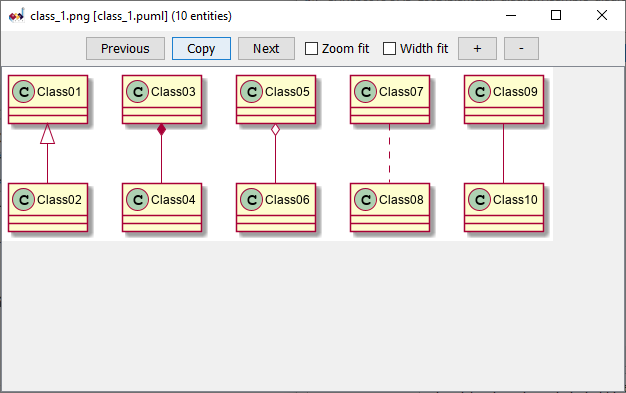

# plantuml-diagram

 ## การติดตั้ง plantuml  เพื่อสร้าง diagram

1.ดาวน์โหลดและติดตั้ง [graphviz](https://graphviz.gitlab.io/_pages/Download/Download_windows.html)

1.1 ใช้ตัว graphviz- x.xx.msi

2.ดาวน์โหลดและติดตั้ง [plantuml.jar](http://sourceforge.net/projects/plantuml/files/plantuml.jar/download)

3.รันโปรแกรม plantuml.jar


3.1 เลือก folder ทำงาน โดยคลิกที่
 Change Directory

4.ทดสอบการทำงาน โดยสร้างไฟล์ class.puml ภายใต้ directory ที่เลือกในข้อ 3.1

4.1 ในไฟล์ class.puml  ให้พิมพ์เนื้อหาต่อไปนี้

``` 
@startuml
Class01 <|-- Class02
Class03 *-- Class04
Class05 o-- Class06
Class07 .. Class08
Class09 -- Class10
@enduml
```
4.2 บันทึกไฟล์ 

graviz จะนำโค้ดไป render เป็นคลาสไดอะแกรมและบันทึกไว้ในโฟลเดอร์ของ code โดยใช้ชื่อเดียวกับ *.puml ดังรูป


4.3 ดับเบิลคลิกที่ชื่อไฟล์ .png จะแสดงไดอะแกรมดังภาพ



4.4 ทดลองแก้ไขโค้ด เมื่อบันทึก graphviz จะ render ใหม่โดยอัตโนมัติ
